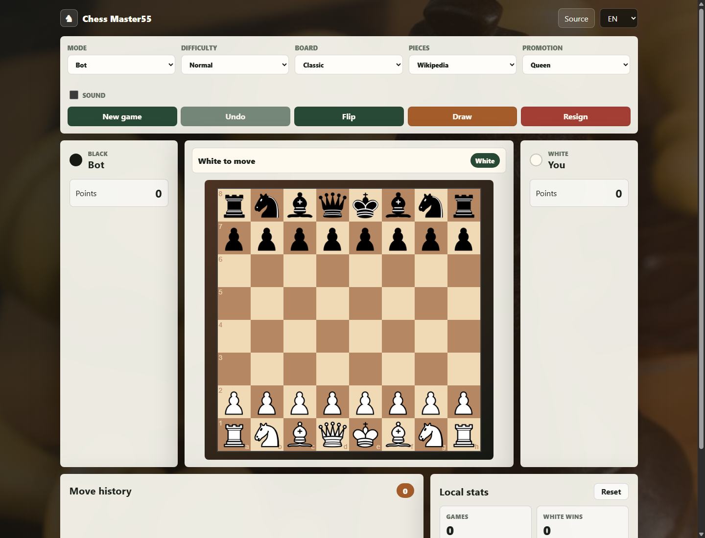
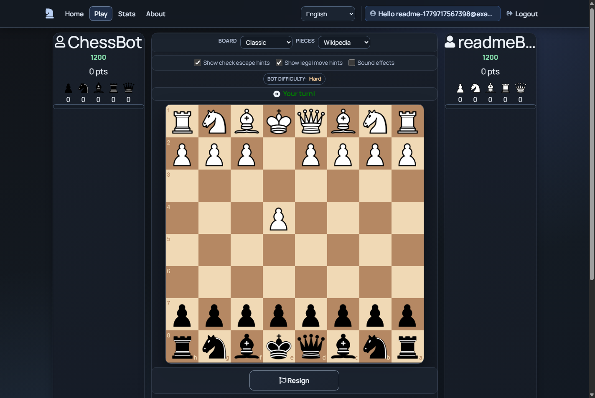

# Chess-master55

[](https://github.com/anton5267/Chess-master55/actions/workflows/github-pages.yml)
[](https://github.com/anton5267/Chess-master55/actions/workflows/full-app-ci.yml)

[](./LICENSE)

Modern chess platform with two editions:

- **Static demo** on GitHub Pages: `https://anton5267.github.io/Chess-master55/`
- **Full ASP.NET Core app** for local or server hosting: MVC, SignalR, Identity, EF Core, SQL database, lobby, multiplayer, bot games, chat, localization, and ELO stats.

The old Azure App Service URL is not treated as the live site anymore. Azure deployment is kept as an optional manual workflow for anyone who configures their own Azure resources.

## Screenshots

| GitHub Pages static demo | Full ASP.NET Core app |
| --- | --- |
|  |  |

## Demo vs Full Version

| Feature | GitHub Pages demo | Full ASP.NET Core app |
| --- | --- | --- |
| Hosting cost | Free GitHub Pages | Needs an ASP.NET Core host + SQL database |
| Backend | No backend, static files only | ASP.NET Core MVC + SignalR |
| Login / Identity | No | Yes |
| Real-time PvP / lobby / chat | No | Yes |
| Bot play | Yes, browser-local Easy/Normal/Hard | Yes, server-backed Easy/Normal/Hard |
| Sound effects | Browser-local toggle | Browser-local toggle inside full app UI |
| Game review | Local post-game summary | Client-side post-game summary from SignalR move history |
| Stats | Browser-local | EF Core + SQL database |
| Source | `docs/` | `src/` |

## English

### Product Overview

- Real-time multiplayer chess over SignalR.
- Bot mode with selectable difficulty.
- Full Identity flow: register, login, account management.
- Stats page with ELO and historical game metrics.
- Multi-language UI: English, Ukrainian, German, Polish, Spanish.
- Static GitHub Pages demo in `docs/` for free public access.
- Optional manual Azure App Service deployment workflow.

### Architecture

- **Web**: ASP.NET Core MVC + Razor Views
- **Realtime**: SignalR hubs (`/hub`)
- **Data**: EF Core + SQL Server
- **Game state**: in-memory session store with synchronization hardening
- **Frontend build**: esbuild bundles for game and stats scripts
- **Client libraries**: LibMan restores Bootstrap, jQuery, SignalR, and chessboard.js

### Prerequisites

- .NET 8 SDK/runtime
- Node.js with npm
- SQL Server Express, LocalDB, or another SQL Server connection string
- LibMan CLI:

```bash
dotnet tool install --global Microsoft.Web.LibraryManager.Cli
```

If tests fail because .NET 8 runtime is missing, install the .NET 8 runtime/SDK. On this machine, a temporary fallback is:

```powershell
$env:DOTNET_ROLL_FORWARD = "Major"
```

### Full Local Development

Run from the repository root:

```bash
cd src/Web/Chess.Web
libman restore
npm ci
npm run build:assets
cd ../../..
dotnet restore src/Chess.sln
dotnet build src/Chess.sln --nologo
dotnet test src/Chess.sln --nologo
dotnet run --project src/Web/Chess.Web/Chess.Web.csproj --urls http://localhost:5000
```

Open: `http://localhost:5000`

The app reads `CONNECTION_STRING` first. If it is not set, it uses `appsettings.Development.json` when `ASPNETCORE_ENVIRONMENT=Development`.

### Static GitHub Pages Demo

Workflow: `.github/workflows/github-pages.yml`

The Pages workflow publishes `docs/` to:

```text
https://anton5267.github.io/Chess-master55/
```

GitHub Pages cannot run the ASP.NET Core server, SignalR hubs, Identity, or EF Core database. The static edition keeps a free public chess demo available with local play, bot play, move history, board themes, and browser-local stats.

What works on GitHub Pages:

- Local two-player chess in one browser.
- Play vs bot with Easy, Normal, and Hard demo difficulty.
- Board/piece themes, promotion choice, undo, flip, draw, resign.
- Sound effects toggle and post-game review.
- Browser-local move history and stats.

Requires the full ASP.NET Core app:

- Register/login and Identity account management.
- Real-time lobby, PvP games, SignalR sync, and chat.
- SQL-backed users, ELO, historical stats, and server-side game flow.

### Optional Ngrok Tunnel

Use this only when you already run the full app locally and need a temporary public URL:

```bash
cd src/Web/Chess.Web
npm run dev:remote:http
```

Or directly:

```bash
ngrok http http://localhost:5000
```

Do not treat an ngrok URL as a permanent production URL unless it is configured in your own ngrok account.

### Testing

```bash
cd src/Web/Chess.Web
npm run check:full
```

Windows-safe test mode stops a running web process first:

```bash
cd src/Web/Chess.Web
npm run check:full:safe
```

If you see `CS2012` (`cannot open ... because it is being used by another process`), stop active `dotnet watch` / `dotnet run` instances and rerun `npm run check:full:safe`.

### Optional Manual Azure Deployment

Workflow: `.github/workflows/master_chess-bg.yml`

This workflow is manual (`workflow_dispatch`) and is not the primary live target. It requires your own Azure App Service and GitHub configuration.

Required secrets for OIDC deployment:

- `AZURE_CLIENT_ID`
- `AZURE_TENANT_ID`
- `AZURE_SUBSCRIPTION_ID`
- `AZURE_WEBAPP_URL` (optional, recommended for explicit health check URL)

Required repository variable:

- `AZURE_WEBAPP_NAME` without `.azurewebsites.net`

Health endpoints:

- `/healthz`
- `/healthz/live`
- `/healthz/ready`

## Українська

### Що це за проєкт

- Онлайн-шахи в реальному часі через SignalR.
- Гра проти бота з вибором складності.
- Повний Identity flow: реєстрація, логін, керування акаунтом.
- Сторінка статистики з ELO та історією партій.
- 5 мов інтерфейсу: EN/UK/DE/PL/ES.
- Безкоштовна статична demo-версія на GitHub Pages у `docs/`.
- Опційний ручний деплой повної версії в Azure App Service.

### Важливо про версії

GitHub Pages запускає тільки статичний сайт. Там не буде логіна, SQL бази, SignalR backend, live multiplayer lobby або серверної статистики. Це demo-версія, щоб сайт був доступний безкоштовно.

Повна версія знаходиться у `src/` і потребує ASP.NET Core hosting + SQL Server.

### Локальний запуск повної версії

Запускати з кореня репозиторію:

```bash
cd src/Web/Chess.Web
libman restore
npm ci
npm run build:assets
cd ../../..
dotnet restore src/Chess.sln
dotnet build src/Chess.sln --nologo
dotnet test src/Chess.sln --nologo
dotnet run --project src/Web/Chess.Web/Chess.Web.csproj --urls http://localhost:5000
```

Відкрити: `http://localhost:5000`

Для локальної бази потрібен SQL Server Express/LocalDB або змінна `CONNECTION_STRING`.

### GitHub Pages demo

Workflow: `.github/workflows/github-pages.yml`

Статична версія публікується з `docs/` сюди:

```text
https://anton5267.github.io/Chess-master55/
```

### Ngrok

Ngrok залишений тільки як опційний локальний tunnel:

```bash
cd src/Web/Chess.Web
npm run dev:remote:http
```

Або напряму:

```bash
ngrok http http://localhost:5000
```

### Перевірка якості

```bash
cd src/Web/Chess.Web
npm run check:full
```

Безпечний Windows-режим, який спочатку зупиняє запущений web process:

```bash
cd src/Web/Chess.Web
npm run check:full:safe
```

### Azure

Azure workflow залишений як ручний legacy/optional deploy. Він не є основною live-версією. Щоб ним користуватися, треба мати власний Azure App Service і налаштувати GitHub secrets/variables.

## Release Notes

See [RELEASE_NOTES.md](./RELEASE_NOTES.md) for production change history.

## License

MIT License. See [LICENSE](./LICENSE).
